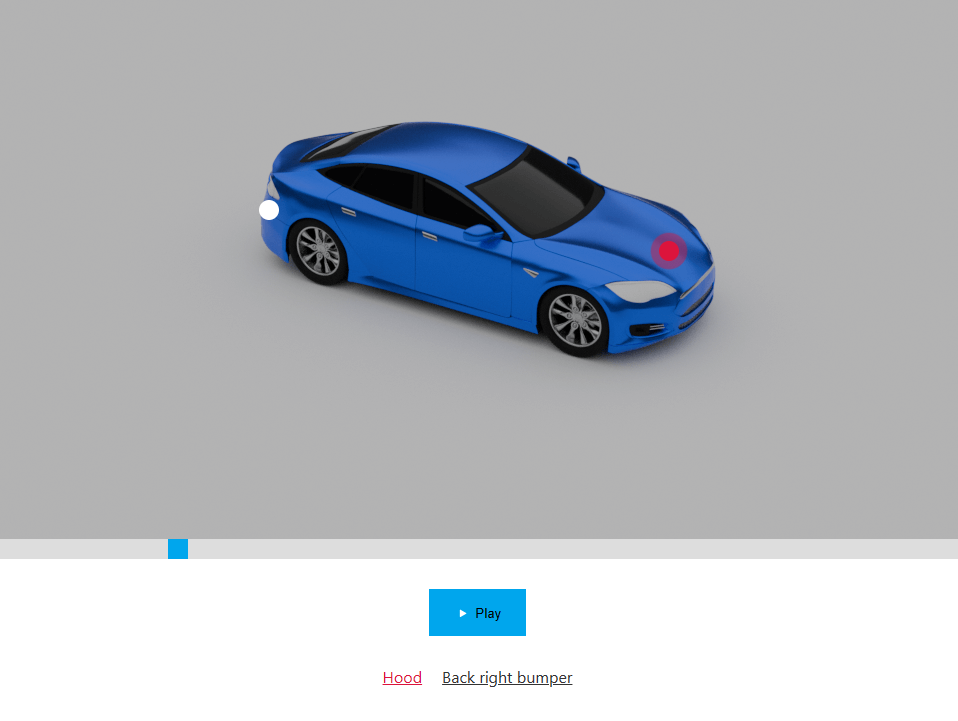

# Product preview

This is a repo of test project I was doing at 2020.
I'm doing an update due to outdated packages, APIs and to improve overall usability a bit.

## How to use
* Select a circle/dot on a product or click a button indicating desired part
* You can flip the product side aka switch the image

## Development
* Run `npm i` to get dependencies
* Run `npm start` to start a project
* This project was bootstrapped with [Create React App](https://github.com/facebook/create-react-app).

## Other
* Images of a producs must have the same dimensions
* In the future versions it would be nice to have as many pictures of a product as you want aka 360 product preview